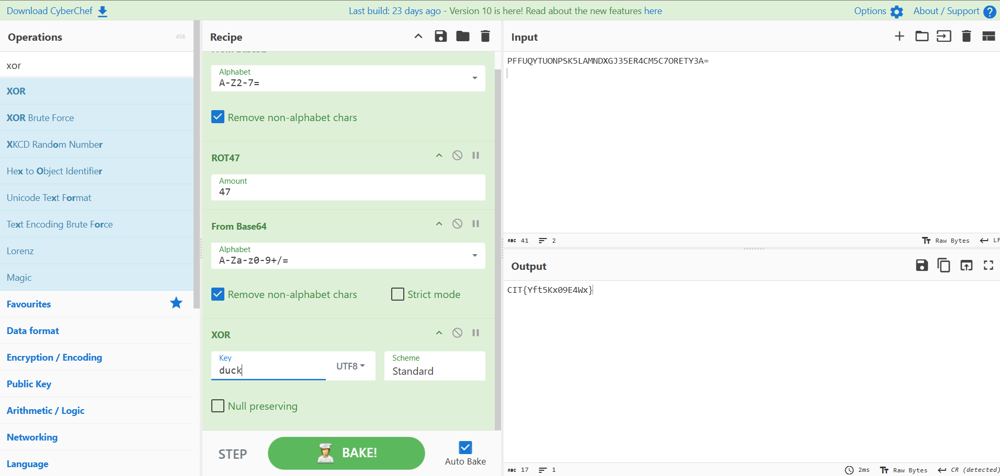

# Very Rotten

## Description:

> PFFUQYTUONPSK5LAMNDXGJ35ER4CM5C7ORETY3A=

## Solution:

Lại một thử thách đoán mò nữa :))

Thử thách này cho chúng ta một Base32 chuỗi vì các chữ cái đều là chữ cái thường

Các bước để giải quyết thách thức này: sử dụng Cyberchef

1. Giải mã Base32 chuỗi
2. Giải mã Rot47 được 1 chuỗi Base64
3. Giải mã Base64 ta được 1 chuỗi vô nghĩa
4. Giải mã XOR với key(UTF 8) là **CIT{** ta được 1 từ có nghĩa **duck**
5. Giải mã XOR với key(UTF 8) **duck** ta được flag



[cyberchef](<https://gchq.github.io/CyberChef/#recipe=From_Base32('A-Z2-7%3D',true)ROT47(47)From_Base64('A-Za-z0-9%2B/%3D',true,false)XOR(%7B'option':'UTF8','string':'duck'%7D,'Standard',false)&input=UEZGVVFZVFVPTlBTSzVMQU1ORFhHSjM1RVI0Q001QzdPUkVUWTNBPQo&oeol=CR>)

```
flag: CIT{Yft5Kx09E4Wx}
```
