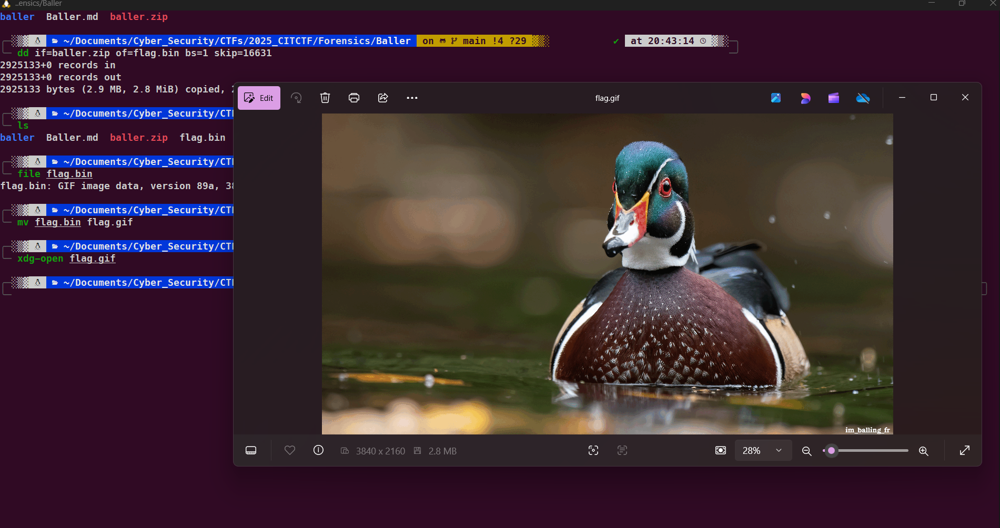

# Baller

## Description:

> Find the flag.

## Solution:

Dùng unzip để giải nén nhưng không giải nén được vì unzip không thực sự là file zip mà chỉ là 1 file nén

```
 unzip baller.zip                                                                                                           ─╯
Archive:  baller.zip
  End-of-central-directory signature not found.  Either this file is not
  a zipfile, or it constitutes one disk of a multi-part archive.  In the
  latter case the central directory and zipfile comment will be found on
  the last disk(s) of this archive.
unzip:  cannot find zipfile directory in one of baller.zip or
        baller.zip.zip, and cannot find baller.zip.ZIP, period.
```

Ta sẽ 7z để giải nén tệp

```
7z x baller.zip                                                                                                            ─╯

7-Zip 24.09 (x64) : Copyright (c) 1999-2024 Igor Pavlov : 2024-11-29
 64-bit locale=en_US.UTF-8 Threads:12 OPEN_MAX:1024, ASM

Scanning the drive for archives:
1 file, 2941764 bytes (2873 KiB)

Extracting archive: baller.zip

WARNINGS:
There are data after the end of archive

--
Path = baller.zip
Type = zip
WARNINGS:
There are data after the end of archive
Physical Size = 16631
Tail Size = 2925133
Characteristics = Local Central

Everything is Ok

Archives with Warnings: 1

Warnings: 1
Folders: 1
Files: 3
Size:       40817
Compressed: 2941764

```

Ok đã giải nén được 3 file 01,02,03.txt nhưng không có gì quan trọng

Ta để ý 7z chỉ giải nén được 1 phần và còn phần đuôi **Tail Size = 2925133**

Ta sẽ cắt 16631 byte đầu ra và chỉ lấy phần đuôi

```
dd if=baller.zip of=flag.bin bs=1 skip=16631                                                                               ─╯
2925133+0 records in
2925133+0 records out
2925133 bytes (2.9 MB, 2.8 MiB) copied, 2.89362 s, 1.0 MB/s
```

Dùng lệnh file biết được đây là 1 file gif đổi tên thành .gif ta được flag



```
flag: CIT{im_balling_fr}
```
