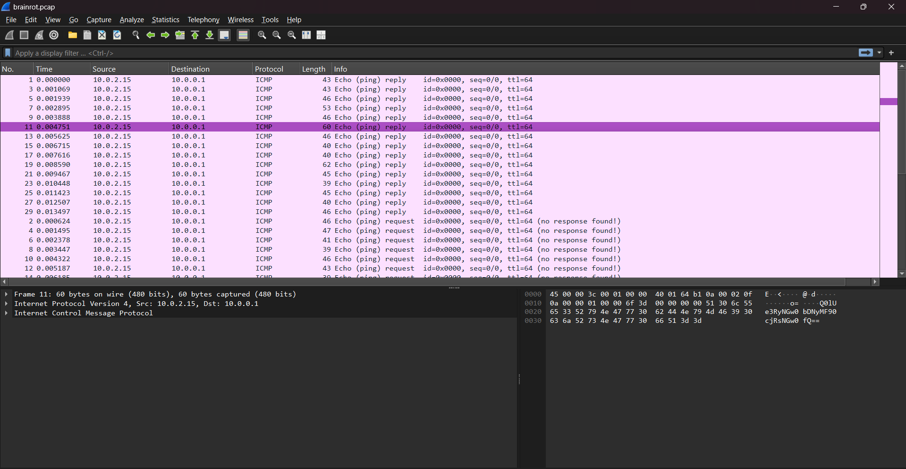

# Brainrot Quiz

## Description:

> Bombardiro Crocodillo or....? You find out...

## Solution:

Mở file bằng Wireshark có các gói tin ICMP để ý từng gói tin ta sẽ thấy gói tin có mã base64, giải mã ta được flag



```
flag: CIT{tr4l4l3r0_tr4l4l4}
```
