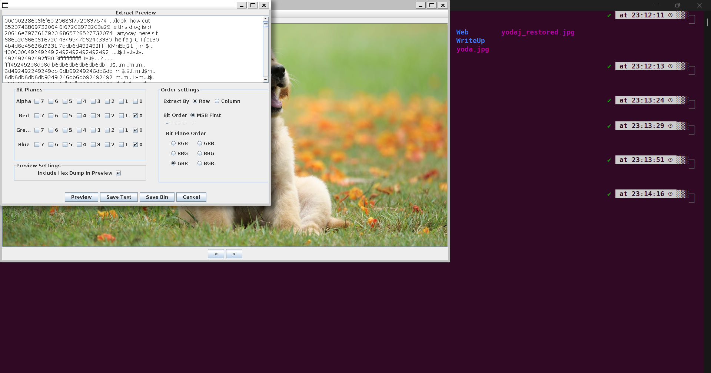

# Dog Picture

## Description:

> Forget about the flag, look at how cute that dog is!

## Solution:

Đây là 1 thử thách khá khó khăn, sử dụng các công cụ phổ biến để xem có điều gì đáng ngờ không thì không thấy có gì bất thường

Cuối cùng là dùng 1 công cụ có tên **Stegsolve** được lập trình bằng java

Bật cửa số Extract Preview và xem các bit nào được giấu text ở trong, thường thường là các bit thấp 0 1 để chất lượng hình ảnh được giữ nguyên không bị méo mó khó phát hiện

Thử 1 lúc thì đây là kết quả (phải hết sự kiện mới solve được :)))



```
zsteg image.png
```

```
flag: CIT{bL30KMnEbj21}
```
