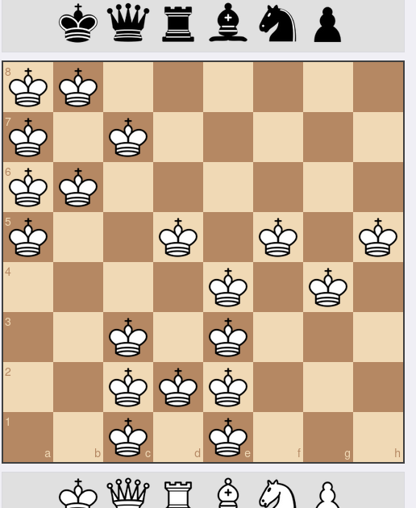

# Queen's Gambit

## Description:

> Like the actual Queen, not the band

## Solution:

Một Thử thách đã đến gần flag rồi nhưng vẫn không solve được

Sử dụng **zsteg** quen thuộc ta thấy 1 đoạn text

```
"a8 a7 a6 a5 b8 c7 b6 d5 e4 f5 g4 h5 c1 c2 c3 d2 e1 e2 e3 "
```

Đây là vị trí của quân cờ trên bàn cờ nhưng vẫn không biết giải ra như nào



Nhìn kĩ thì mới thấy ghép lại thành chữ **PWN**

```
flag: CIT{PWN}
```
