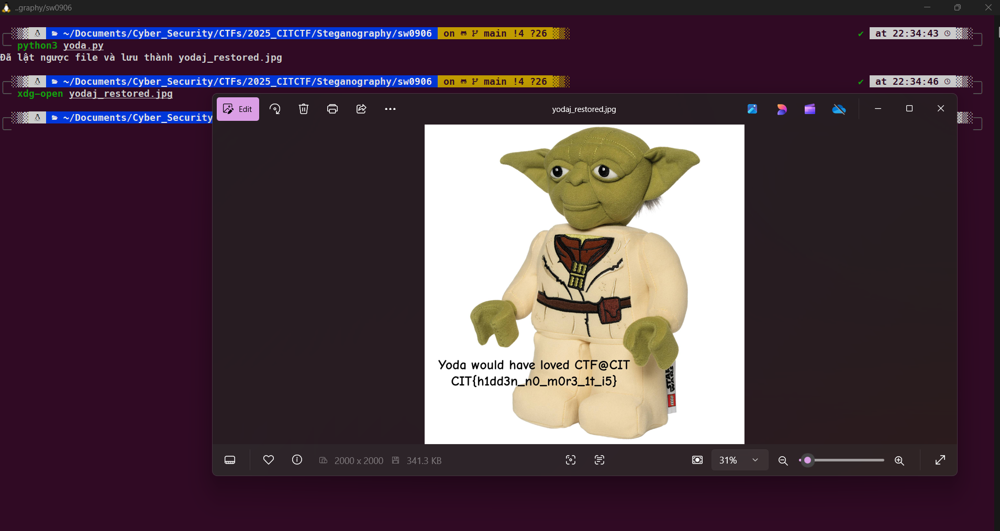

# sw0906

## Description:

> Deceive you, the bytes do. Look deeper, you must.

## Solution:

Mở file bằng notepad ta thấy không đọc được nên thử mở bằng **HxD**

Ta thấy các byte giống như 1 ảnh png dạng jfif nhưng các byte cũng đã bị xáo trộn sắp xếp lại cho đúng thứ tự và thêm đuôi file .jpg nhưng vẫn không mở được

Để ý khi sắp xếp lại thì theo 1 quy luật cứ 4 byte thì lật ngược lại, thử với nhiều hàng hơn thì vẫn không được nên ta đoán file này đã bị xáo trộn tất cả các byte theo quy luật trên

Viết 1 tập lệnh python để sắp xếp lại

```
with open("yoda.jpg", "rb") as f:
    data = bytearray(f.read())

for i in range(0, len(data), 4):
    chunk = data[i:i+4]
    if len(chunk) == 4:
        data[i:i+4] = chunk[::-1]

with open("yodaj_restored.jpg", "wb") as f:
    f.write(data)

print("Đã lật ngược file và lưu thành yodaj_restored.jpg")
```

Mở ảnh lại ta được flag



```
flag: CIT{h1dd3n_n0_m0r3_1t_i5}
```
