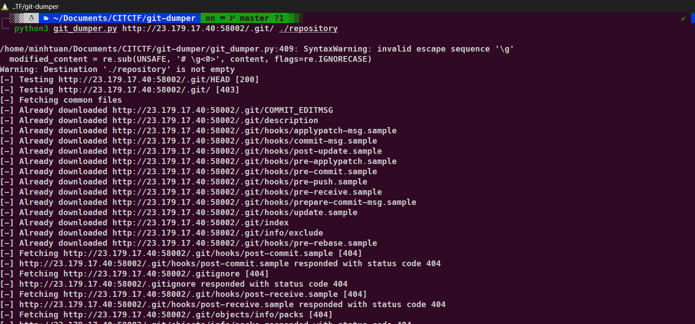
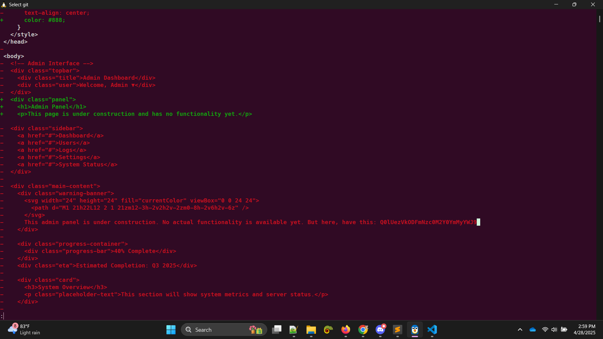

# Commit & Order: Version Control Unit

## Description:

> "In software development, the repository is represented by two separate yet equally important branches..."

## Solution:

Nhìn vào đề bài có những gợi ý như **Commit**, **repository** ta nghĩ ngay đến trang web này có thể bị lộ repository phổ biến nhất là **/.git**

Để chắc chắn với điều đó ta sẽ thử với đường dẫn
`http://23.179.17.40:58002/.git/HEAD` server trả về `ref: refs/heads/master`

OK giờ thì đơn giản là dùng tool [Git Dumper](https://github.com/arthaud/git-dumper) để kéo toàn bộ repository về máy của mình



Giờ ta chỉ cần dùng 1 số câu lệnh git để check 1 số commit xem code có bị xóa không

```
git show 9b8bf13600c17ba7cbbc9ac7dcffaebd36b16b36
```



```
flag: CIT{5d81f7743f4bc2ab}
```
