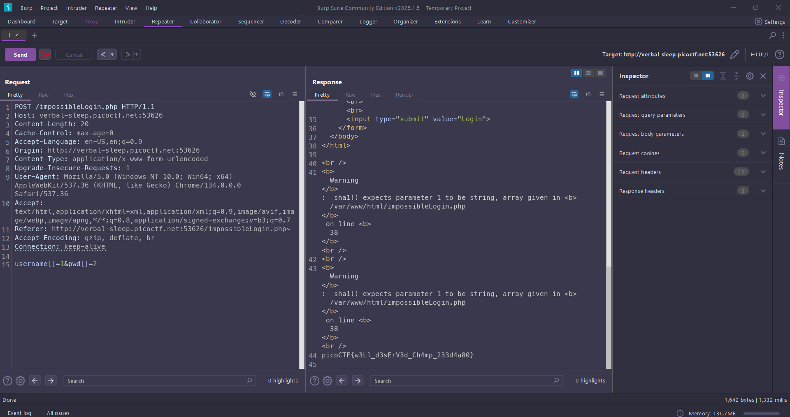

# Apriti sesamo

Web, 100 points

## Description:

> I found a web app that claims to be impossible to hack!

## Hint:

> 1.  Backup files
> 2.  TRumor has it, the lead developer is a militant emacs user

## Solution:

Nhìn vào hint là backup files ta có thể đoán được là có đường dẫn ẩn trong trang web và để ý emacs là 1 trình soạn thảo văn bản với file khởi tạo là `~/.emacs`. Một cách khác là dùng `gobuster` để bruteforce các file ẩn của trang web(Chắc là được :) )

Ta truy cập với đường dẫn

```
http://verbal-sleep.picoctf.net:53626/impossibleLogin.php~
```

F12 lên ta sẽ thấy 1 đoạn mã php bị comment

```
<!--?php
 if(isset($_POST[base64_decode("\144\130\x4e\154\x63\155\x35\x68\142\127\125\x3d")])&& isset($_POST[base64_decode("\143\x48\x64\x6b")])){$yuf85e0677=$_POST[base64_decode("\144\x58\x4e\154\x63\x6d\65\150\x62\127\x55\75")];$rs35c246d5=$_POST[base64_decode("\143\x48\144\153")];if($yuf85e0677==$rs35c246d5){echo base64_decode("\x50\x47\112\x79\x4c\172\x35\x47\x59\127\154\163\132\127\x51\x68\111\x45\x35\166\x49\x47\132\163\131\127\x63\x67\x5a\155\71\171\111\x48\x6c\166\x64\x51\x3d\x3d");}else{if(sha1($yuf85e0677)===sha1($rs35c246d5)){echo file_get_contents(base64_decode("\x4c\151\64\166\x5a\x6d\x78\x68\x5a\x79\65\60\145\110\x51\75"));}else{echo base64_decode("\x50\107\112\171\x4c\x7a\65\107\x59\x57\154\x73\x5a\127\x51\x68\x49\105\x35\x76\111\x47\132\x73\131\127\x63\x67\x5a\155\71\x79\x49\110\154\x76\x64\x51\x3d\75");}}}?-->
```

Format code và decode cho dễ đọc

```
<?php
if (isset($_POST["username"]) && isset($_POST["password"])) {
    $username = $_POST["username"];
    $password = $_POST["password"];

    if ($username == $password) {
        echo "<bring>";
    } else {
        if (sha1($username) === sha1($password)) {
            echo file_get_contents("../flag.txt");
        } else {
            echo "<bring>";
        }
    }
}
?>

```

Tóm lại là nó sẽ lấy username và password khi mình nhập vào và kiểm tra. Muốn lấy được flag thì username và password phải khác nhau nhưng mã băm `sha1` của cả hai phải giống nhau

Nghe như đùa, như này người ta gọi là va chạm băm và trên thế giới chưa có 2 từ nào như vậy, có thế trong tương lai sẽ có :))

Suy nghĩ 1 lúc và chatgpt các kiểu thì chỉ có thể là giá trị `null`, mà sha1 băm ra giá trị null chỉ có thể là mảng

Dùng Burp Suite gửi lên với 2 trường `username[]=1&pwd[]=2` PHP sẽ hiểu `$_POST['username']` là một mảng với phần tử đầu tiên là 1 khi nó không lọc đầu vào và như vậy ta đã có thể đăng nhập



```
picoCTF{w3Ll_d3sErV3d_Ch4mp_233d4a80}
```
