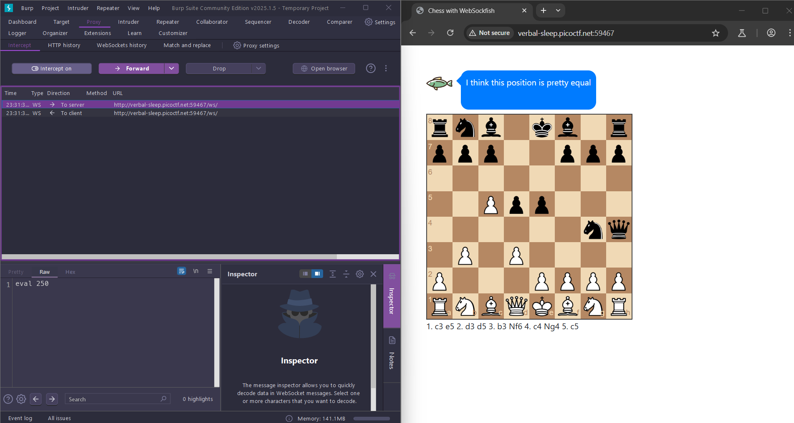

# WebSockFish

Web, 100 points

## Description:

> Can you win in a convincing manner against this chess bot? He won't go easy on you!

## Hint:

> 1. Try understanding the code and how the websocket client is interacting with the server

## Solution:

Một thử thách liên quan đến websocket(là 1 giao thức giao tiếp 2 chiều giữa client và server để truyền dữ liệu qua mạng)

Đây là 1 trang web đánh cờ vua với boss, với 1 đứa không biết chơi như tôi thì không hiểu gì cả, tôi còn không biết những quân gì và đi hướng nào nữa :))

Dùng Burp Suite để bắt các response mà server trả về khi boss đi 1 nước



Khi nó đánh 1 nước nó sẽ trả về hàm `eval value ` để mình gửi lên server với value càng ngày càng lớn, Vì tôi không biết chơi nên không hiểu là đi nước nào sẽ là tối ưu hơn nước nào, nhưng khi nó ăn được quân của tôi thì nó trả về hàm `eval` với `value` rất lớn tôi mới nhận ra `eval` đấy là hàm để đánh giá giá trị tối ưu của 1 nước đi của con boss. Tôi đã sửa `eval -9999999` và con boss nó đã thua hehehe

```
Huh???? How can I be losing this badly... I resign... here's your flag: picoCTF{c1i3nt_s1d3_w3b_s0ck3t5_e5e75e69}
```
