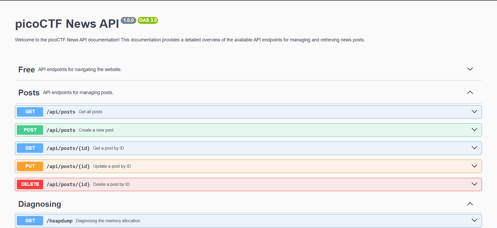

# head-dump

Web, 100 points

## Description:

> Welcome to the challenge! In this challenge, you will explore a web application and find an endpoint that exposes a file containing a hidden flag.
> The application is a simple blog website where you can read articles about various topics, including an article about API Documentation. Your goal is to explore the application and find the endpoint that generates files holding the server’s memory, where a secret flag is hidden.
> The website is running [picoCTF News](http://verbal-sleep.picoctf.net:56165/).

## Hint:

> 1.  Explore backend development with us
> 2.  The head was dumped.

## Solution:

Đọc đề bài ta thấy đây là 1 trang web blog có nhiều bài viết về tài liệu API và mục tiêu là tìm điểm cuối hiển thị tệp có chứa cờ ẩn, tức là đường dẫn đã bị che dấu và có thể tải về được 1 tệp gì đó khi vào đúng đường dẫn

Dùng **gobuster** để burte-force các thư mục, file ẩn nhưng không tìm được gì khả nghi

Sau đó ta để ý từng bài viết trong trang web thì có những cái tag, bấm vào **#API Documentation** đây là một docs hướng dẫn sử dụng API



Nhìn xuống dưới ta thấy 1 đường dẫn **/heapdump** chẩn đoán phân vùng bộ nhớ

```
http://verbal-sleep.picoctf.net:64126/heapdump
```

Ta sẽ tải xuống 1 tệp **heapdump-1742377495738.heapsnapshot** Mở ra tìm pico ta sẽ thấy được flag

```
picoCTF{Pat!3nt_15_Th3_K3y_bed6b6b8}
```
